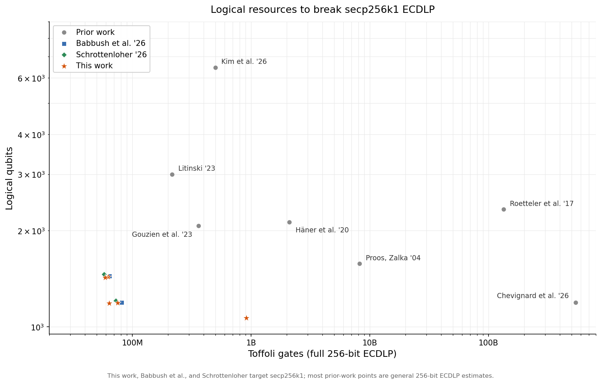
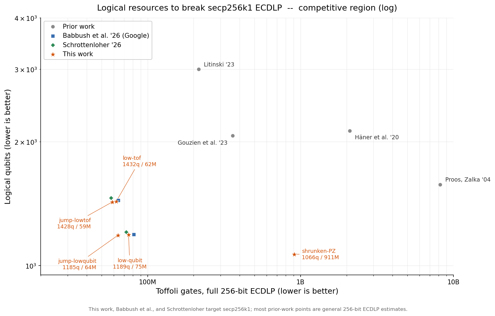
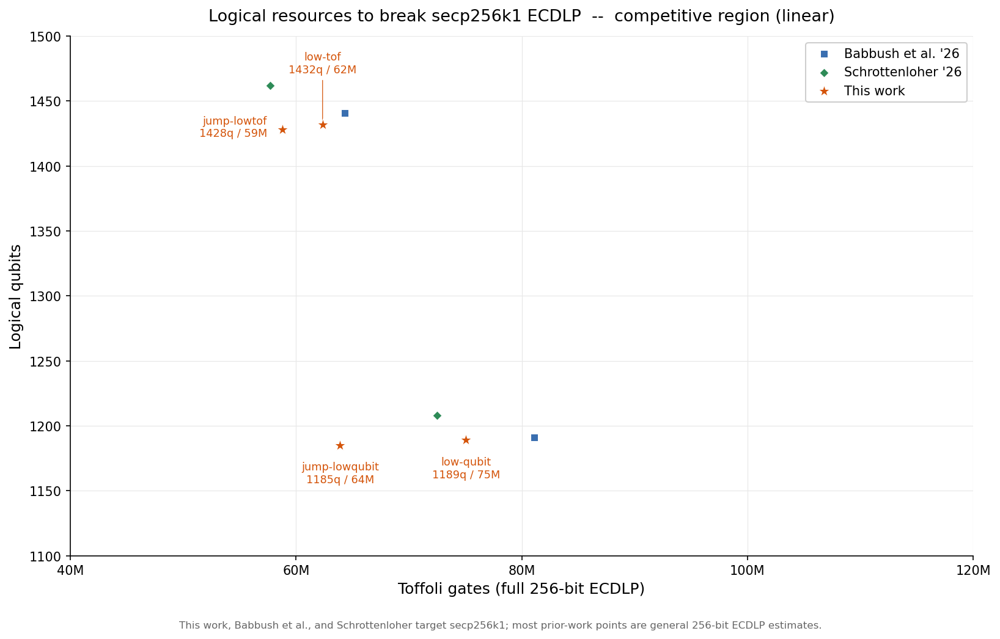

# Quantum reversible EC point-addition for secp256k1

This repo synthesizes, simulates, verifies, and validates reversible quantum
circuits for elliptic-curve point addition -- the inner loop of Shor's attack on
ECDLP -- and scores them against the Google Quantum AI ECC whitepaper's two
operating points for one secp256k1 `P += Q`: <= 1175 logical qubits / <= 2.7M
Toffoli (`Clow-qubit`) and <= 1425 qubits / <= 2.1M Toffoli (`Clow-gate`)
(`papers/cryp_paper.txt`).

- `trailmix/` -- the in-house toolchain: a reversible-circuit IR, a 64-shot
  parallel simulator, an abstract-interpretation phase-correctness gate, a
  spooky-pebble ghost API, a time-travel debugger, a per-section profiler, and the
  EC-add circuits themselves (secp256k1 plus Curve25519 / SM2 / Brainpool).
- `zkp_ecc_zenodo/` -- the native zkp_ecc Simulator (the same one compiled into the
  SP1 zkVM guest) that replays a `.kmx` circuit and asserts its resource counts
  over thousands of Fiat-Shamir shots.
- `papers/` -- the cited prior art (Schrottenloher, Proos-Zalka, Roetteler,
  Cuccaro, Gidney, Khattar-Gidney, the Google whitepaper).
- `kmx_circuit_summaries.md` -- the per-circuit executive summaries;
  `trailmix/notes/` -- design notes and replication status.

---

## Where this lands

This work's five circuits against the published prior art and Google's two cost
targets, as logical resources for a full 256-bit ECDLP attack (each point-add
cost extrapolated through windowed scalar multiplication):



The competitive region, on log and then linear axes:





This work and the two cost targets are secp256k1-specific (its special prime
makes the modular arithmetic cheaper); most prior-work points are general
256-bit ECDLP estimates, so the cross-comparison is indicative.

Regenerate with `python3 plot.py`.

---

## The circuits

All five compute the same in-place affine `P += Q` on secp256k1 (`P` in quantum
registers, `Q` classical per shot). They differ only in the modular-inversion
engine and where they sit on the qubit/Toffoli exchange curve. Full,
citation-dense writeups (algorithm, cost, peak, prior-art basis, and the specific
optimizations layered on top) are in
[`kmx_circuit_summaries.md`](kmx_circuit_summaries.md).

| config | emit bin | inversion engine | qubits | Toffoli | based on |
|---|---|---|--:|--:|---|
| low-qubit | `emit_test_ec_add_schrottenloher` | Schrottenloher EEA dialog, `dialog_m=5` base-3 pack, no venting | 1173 | ~2.48M | Schrottenloher arXiv:2606.02235 (Google `Clow-qubit` 1175q / 2.7M) |
| low-tof | `emit_test_ec_add_schrottenloher_lowtof` | same dialog, `dialog_m=3` Fig.1 pack plus coupled venting | 1416 | ~2.03M | Schrottenloher arXiv:2606.02235 (Google `Clow-gate` 1425q / 2.1M) |
| jump-lowqubit | `emit_test_ec_add_schrottenloher_jump` | jump-GCD dialog (Stein-style, `jump=2`), base-5 pack, no venting | 1169 | ~2.09M | Schrottenloher arXiv:2606.02235 + Stein binary GCD |
| jump-lowtof | `emit_test_ec_add_schrottenloher_jump_lowtof` | same jump-GCD dialog plus coupled venting | 1412 | ~1.90M | Schrottenloher arXiv:2606.02235 + Stein binary GCD |
| shrunken-PZ | `emit_test_ec_add_shrunken_pz` | reversible Proos-Zalka divstep state machine | 1050 | ~32.3M | Proos-Zalka 2003 (arXiv:quant-ph/0301141); Roetteler lambda-cancel (arXiv:1706.06752) |

The first four share the Schrottenloher EEA-dialog code path (Andre Schrottenloher,
"Optimized Point Addition Circuits for Elliptic Curve Discrete Logarithms,"
arXiv:2606.02235), which obtains `1/dx` by running the in-place modular-multiply
circuit backwards. They turn two independent knobs:

- Inversion: the divstep dialog (low-qubit, low-tof) reduces the binary-GCD pair
  one bit per step; the jump-GCD dialog (jump-lowqubit, jump-lowtof) is a
  Stein-style variant that removes up to `jump=2` trailing zeros of `v` per step.
  Fewer steps means the per-step adders (the GCD subtract/swap and the `apply_bv`
  mod-add) fire fewer times, for a Toffoli saving at roughly unchanged tape length
  -- each step records its shift count (three windows packed into a 7-bit base-5
  code), and the step reduction more than pays for that extra bit.
- Venting: the low-tof variants spend ~240 more qubits on `apply_bv`-phase Gidney
  measure-and-fixup venting to drop Toffoli further.

So jump-lowqubit is the low-qubit corner with the cheaper inversion: at 1169q /
2.09M it sits under both Google operating points on both axes (below `Clow-qubit`'s
1175q / 2.7M and `Clow-gate`'s 1425q / 2.1M). jump-lowtof is the low-tof corner the
same way (1412q / 1.90M, under `Clow-gate` on both axes).

shrunken-PZ is a different family: a reversible divstep state machine (the
Proos-Zalka 2003 extended-Euclidean inversion made reversible) that materializes
the slope `lambda` and cancels it with an alt-witness second division (Roetteler
slope-invariance, two inversions per add against Roetteler's four). It reaches the
qubit-minimal corner at 1050 qubits for a Toffoli-maximal cost (~32.3M Toffoli,
~100M ops).

Shared prior art across all five: Cuccaro adders (arXiv:quant-ph/0410184), Gidney
measure-and-fixup uncomputation (Quantum 2, 74, 2018), the Gidney constant adder
(arXiv:2507.23079), Khattar-Gidney prefix-AND / log\*-ancilla MCX (arXiv:2407.17966), and
Vandaele comparators (arXiv:2603.12917, Thm 3), with the Google ECC whitepaper as
the cost target.

---

## Quick start: generate and validate the circuits

The pipeline emits each EC-add circuit to a `.kmx` file and replays it through the
native zkp_ecc Simulator with explicit qubit / Toffoli / op caps:

```bash
./gen_and_validate_kmx.sh
```

`gen_and_validate_kmx.sh`:

1. Emits the five EC-add `.kmx` configs into `trailmix/kmx_out/` (gitignored)
   via the `emit_test_ec_add_*` binaries.
2. Builds the zenodo `native_fuzz` tool (the SP1-guest Simulator).
3. Runs it on each `.kmx` over 9000 Fiat-Shamir shots, asserting the circuit stays
   under its `<qubits> <toffoli> <ops>` caps and computes `P += Q` correctly on
   every shot.

`NUM_TESTS=<n>` changes the shot count; `CIRC_OPS_CAP` (set automatically for the
large shrunken-PZ stream) bounds the op buffer. The harness needs the
`zkp_ecc_zenodo/` sibling checkout. Toffoli are counted as executed CCX+CCZ
averaged across shots, the metric Google scores. The op stream is input-independent
(the classical point `Q` enters as runtime controls), so each circuit is built once
and the fuzzer reloads its own 9000 random cases.

---

## The runtime (`trailmix`)

The toolchain is implemented in-house. Full inventory with `file:line`
references in [`trailmix/notes/OVERVIEW.md`](trailmix/notes/OVERVIEW.md); the
highlights:

- 64-shot parallel simulator, built into the builder. Each qubit is one `u64` (one
  bit per shot); X/CX/CCX/Z/HMR are single bitwise ops across all 64 shots. The
  HMR RNG is seeded from `thread_rng` once per run (never a fixed seed), so every
  run exercises a different measurement pattern, and Toffoli are counted per fired shot
  (`popcount(fire_mask)`), exactly Google's average-executed-Toffoli metric.
- Phase-lattice correctness gate (`src/tracker/phase_lattice.rs`): a per-gate
  abstract interpreter (`AbsVal` per qubit: Zero/One/CopyOf/AndOf/XorOf/...).
  `prove_zero` is the hard gate before any qubit free; `assert_phase_clean` verifies
  every HMR phase obligation structurally cancels. It catches precondition
  violations the sim alone does not.
- Time-travel debugger (`src/tracker/debugger/`): gate-by-gate replay over the sim
  with full-state checkpoints and a per-op `Delta` ring buffer for O(1) backward
  steps. The canonical recipe is `watch q<N>` plus `rb` (run backward to the op
  that broke an invariant) plus `src <op>` (maps any op to its emitting
  `file:line`). Auto-attaches on failure under `DEBUG_ON_FAIL=1`.
- Ghost / spooky-pebble API (`src/tracker/ghost.rs`): a `#[must_use]` `Ghost`
  captures an HMR's 64-shot mask and anchor; `resolve_ghost` sim-verifies the
  discharge and emits the cancelling phase fix-up. This is what lets shrunken-PZ
  ghost a 256-bit coordinate so it and `lambda` are never both live.
- Move-only qubit ownership and strict dealloc. `QReg` is a linear RAII handle (no
  Copy/Clone); drop queues a free. A lowest-id free-pool packs densely; every free
  asserts last-touch > last-alloc (no wasteful retention) and `prove_zero` (no dirty
  free) at the exact site.
- A redundant-op elider, inline ghost-aware `contract_check` invariants, an
  `emit_reverse_since` generic uncompute, streaming metrics on
  multi-hundred-million-op circuits, and assertion caps:
  `CIRC_ASSERT_MAX_QUBIT_PEAK` fires the instant live qubits first cross the cap,
  and `CIRC_ASSERT_MAX_OPS` prints a per-section cost breakdown.

The arithmetic primitives are organized by purpose under `trailmix/src/arith/`:
`cuccaro` (ripple adders), `mcx` (multi-controlled-X), `compare`, `const_add`,
`shift`, `khattar_gidney` (prefix-AND / increment / comparison kernel),
`ripple_add`, `mod_arith` (modular field ops), and `schrottenloher/` (the dialog
inversion). The EC drivers live in `trailmix/src/ec/`, the reversible-divstep
inversion in `trailmix/src/inversion/`.

---

## Building and testing

```bash
cd trailmix
# all cargo invocations go through the 8 GB memory-scoped wrapper:
./scripts/run_8g_scope.sh cargo build --release --lib
./scripts/run_8g_scope.sh cargo test  --release --lib <filter> -- --test-threads=1

# headline end-to-end test (one shrunken-PZ EC-add, 64 random pairs, clean teardown):
./scripts/run_8g_scope.sh cargo test --release --lib ec_add_inplace_shrunken_pz_random_64
```

See [`trailmix/notes/OVERVIEW.md`](trailmix/notes/OVERVIEW.md) for the
time-travel debugger and profiling workflow.

---

## Profile visualizer

`profile_viz.py` renders an interactive HTML profile of any EC-add config from
the simulator's own per-section metrics: an occupancy envelope (live qubits over
circuit time, colored by phase), a leaf cost landscape (Toffoli x local-peak x
headroom -- which leaves sit *at* the qubit peak versus have room to
measure-vent), and the peak composition (what occupies the qubit peak).

```bash
cd trailmix
# dump one or more configs (writes kmx_out/profile_<name>.json):
PROFILE_JSON=1 PROFILE_NAME=jump-lowqubit \
  cargo run --release --bin profile_ec_add_schrottenloher jump
PROFILE_JSON=1 PROFILE_NAME=low-qubit \
  cargo run --release --bin profile_ec_add_schrottenloher 5
# render (globs kmx_out/profile_*.json):
cd .. && python3 profile_viz.py            # -> circuit_profiles.html
```

`PROFILE_JSON=1` adds a one-shot JSON dump to `profile_ec_add_schrottenloher`,
reusing the simulator's existing `live_series` / `section_marks` / `section_peak`
/ `peak_live_tags` (no circuit instrumentation, gate-neutral). `profile_viz.py`
is stdlib-only; open the resulting HTML in any browser.
